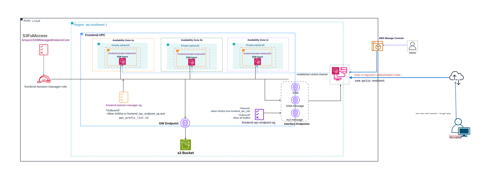
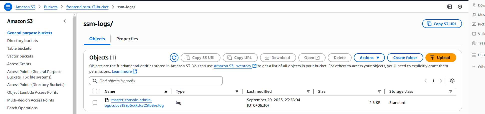

# AWS Session Manager with Secure access and logging
## Overview

Traditionally, managing private EC2 instances in AWS required SSH key pairs and bastion hosts. This approach meant opening inbound ports such as SSH (22) or RDP (3389), which not only increased the attack surface but also added operational overhead in managing keys and maintaining bastion hosts.

AWS Systems Manager (SSM) Session Manager provides a secure, centralized way to manage nodes on both AWS and on-premises servers. With Session Manager, you can access your instances without bastion hosts, inbound ports, or SSH key management. Session Manager uses the SSM Agent on each instance to establish a secure channel.

**In this project**, I will demonstrate how to set up AWS SSM to:

- Securely connect to private EC2 instances.

- Automatically store session logs in an aws S3 bucket for debugging and auditing.

**Project Goal** : The EC2 instance running in a private subnet will be managed using Session Manager. And then, all session activity logs will be automatically stored in S3 bucket, ensuring auditing and accountability by tracking who accessed the instance and when.


## Architecture

---

## Prerequisites

- Terraform installed

- AWS CLI configured with appropriate permissions

- Session Manager Plugin installed on your local machine:
  Install Session Manager Plugin
---

## Deployment Steps

### Clone Repository

```bash

git clone git@gitlab.com:tunnyein/aws-ssm-project-03-with-s3-bucket.git
cd aws-ssm-project-03-with-s3-bucket.git

```

### Configure Variables  with your desired configuration

### Deploy Infrastructure

```bash

# Initialize Terraform
terraform init


# Review planned changes
terraform plan

-----
# Deploy infrastructure
terraform apply -auto-approve


```
---

## To Connect to your private EC2 instances

```
$ aws ssm start-session --target xxxxxxxxx --profile your aws proile

Starting session with SessionId: your aws proile-d9dgf2btyrzro2274ako4su6hi
$ hostname
ip-10-0-253-136
$ ip addr
1: lo: <LOOPBACK,UP,LOWER_UP> mtu 65536 qdisc noqueue state UNKNOWN group default qlen 1000
    link/loopback 00:00:00:00:00:00 brd 00:00:00:00:00:00
    inet 127.0.0.1/8 scope host lo
       valid_lft forever preferred_lft forever
    inet6 ::1/128 scope host noprefixroute 
       valid_lft forever preferred_lft forever
2: enX0: <BROADCAST,MULTICAST,UP,LOWER_UP> mtu 9001 qdisc fq_codel state UP group default qlen 1000
    link/ether 02:35:0c:e4:54:03 brd ff:ff:ff:ff:ff:ff
    inet 10.0.253.136/24 metric 100 brd 10.0.253.255 scope global dynamic enX0
       valid_lft 3321sec preferred_lft 3321sec
    inet6 fe80::35:cff:fee4:5403/64 scope link 
       valid_lft forever preferred_lft forever
$ 
```
---
### session log in S3


---
### session logs 

```bash
Script started on 2025-09-29 16:58:03+00:00 [COMMAND="cat /var/lib/amazon/ssm/i-00cbf6ce81675216c/session/orchestration/master-console-admin-ogucubv3f8zp6xxkdxv25lb3re/Standard_Stream/ipcTempFile.log" <not executed on terminal>]
$ ip    pwd

/var/snap/amazon-ssm-agent/11797

$ ip addr

1: lo: <LOOPBACK,UP,LOWER_UP> mtu 65536 qdisc noqueue state UNKNOWN group default qlen 1000

    link/loopback 00:00:00:00:00:00 brd 00:00:00:00:00:00

    inet 127.0.0.1/8 scope host lo

       valid_lft forever preferred_lft forever

    inet6 ::1/128 scope host noprefixroute 

       valid_lft forever preferred_lft forever

2: enX0: <BROADCAST,MULTICAST,UP,LOWER_UP> mtu 9001 qdisc fq_codel state UP group default qlen 1000

    link/ether 02:31:e1:8f:c7:6d brd ff:ff:ff:ff:ff:ff

    inet 10.0.253.251/24 metric 100 brd 10.0.253.255 scope global dynamic enX0

       valid_lft 3424sec preferred_lft 3424sec

    inet6 fe80::31:e1ff:fe8f:c76d/64 scope link 

       valid_lft forever preferred_lft forever

$ l sudo lsof -i :443

COMMAND    PID USER   FD   TYPE DEVICE SIZE/OFF NODE NAME

snapd      597 root   10u  IPv4  10353      0t0  TCP ip-10-0-253-251.ap-southeast-1.compute.internal:42734->api.snapcraft.io:https (SYN_SENT)

snapd      597 root   13u  IPv4  10396      0t0  TCP ip-10-0-253-251.ap-southeast-1.compute.internal:40494->api.snapcraft.io:https (SYN_SENT)

snapd      597 root   14u  IPv4  10363      0t0  TCP ip-10-0-253-251.ap-southeast-1.compute.internal:51884->api.snapcraft.io:https (SYN_SENT)

snapd      597 root   15u  IPv4  10446      0t0  TCP ip-10-0-253-251.ap-southeast-1.compute.internal:44012->api.snapcraft.io:https (SYN_SENT)

snapd      597 root   16u  IPv4  10447      0t0  TCP ip-10-0-253-251.ap-southeast-1.compute.internal:39912->api.snapcraft.io:https (SYN_SENT)

snapd      597 root   17u  IPv4  10451      0t0  TCP ip-10-0-253-251.ap-southeast-1.compute.internal:34344->api.snapcraft.io:https (SYN_SENT)

ssm-agent 1201 root   13u  IPv4  10227      0t0  TCP ip-10-0-253-251.ap-southeast-1.compute.internal:50358->ip-10-0-253-68.ap-southeast-1.compute.internal:https (ESTABLISHED)

ssm-sessi 1211 root   10u  IPv4  10256      0t0  TCP ip-10-0-253-251.ap-southeast-1.compute.internal:54918->ip-10-0-253-68.ap-southeast-1.compute.internal:https (ESTABLISHED)

ssm-sessi 1211 root   15u  IPv4  10260      0t0  TCP ip-10-0-253-251.ap-southeast-1.compute.internal:54932->ip-10-0-253-68.ap-southeast-1.compute.internal:https (ESTABLISHED)

$ exit
Script done on 2025-09-29 16:58:03+00:00 [COMMAND_EXIT_CODE="0"]

```
---

## ⚠️ Clean Up Resources

Don’t forget to **destroy your infrastructure after testing** to avoid unnecessary AWS charges.

```bash

terraform destroy -auto-approve


```
---
Thank You