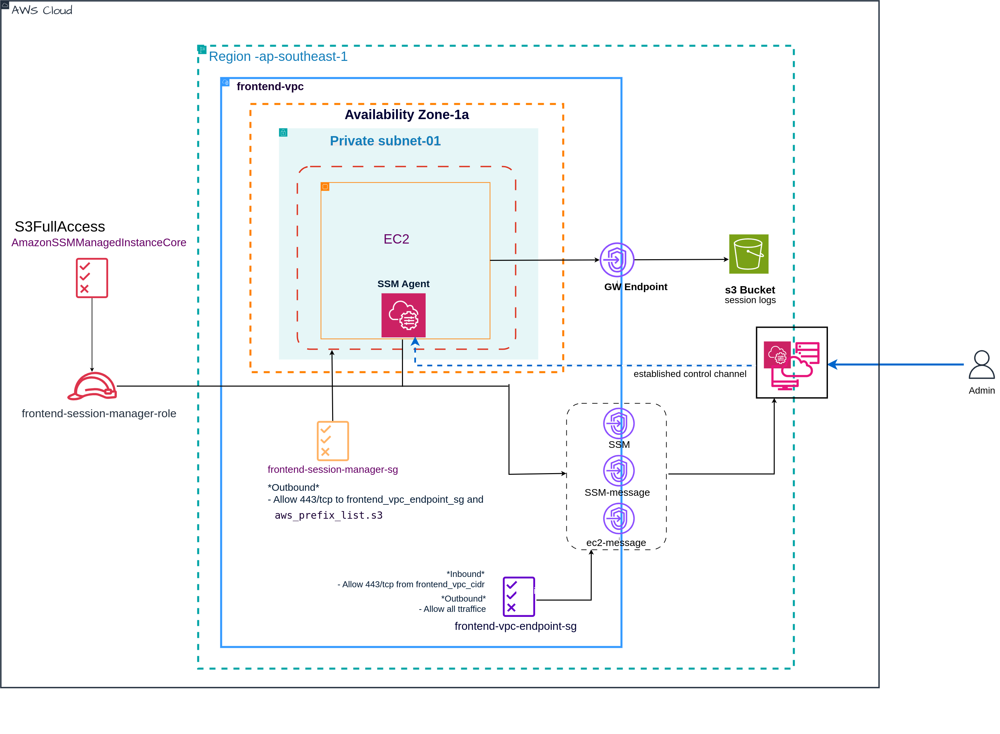

# AWS SSM Project 03 – S3
## 📖 Overview
This project demonstrates how to use AWS Systems Manager (SSM) Session Manager to securely connect to EC2 instances and automatically **store session log data in an S3 bucket** for debugging and troubleshooting.


## 📐 Architecture

---

## ⚙️ Prerequisites

- Terraform installed

- AWS CLI configured with appropriate permissions

- Session Manager Plugin installed on your local machine:
  Install Session Manager Plugin

---

## 🚀 Deployment Steps

### Clone Repository

```bash

git clone git@gitlab.com:tunnyein/aws-ssm-project-03-with-s3-bucket.git
cd aws-ssm-project-03-with-s3-bucket.git

```

### Configure Variables  with your desired configuration

### Deploy Infrastructure

```bash

# Initialize Terraform
terraform init


# Review planned changes
terraform plan

-----
# Deploy infrastructure
terraform apply -auto-approve


```
---

## To Connect to your private EC2 instances

```
$ aws ssm start-session --target xxxxxxxxx --profile your aws proile

Starting session with SessionId: your aws proile-d9dgf2btyrzro2274ako4su6hi
$ hostname
ip-10-0-253-136
$ ip addr
1: lo: <LOOPBACK,UP,LOWER_UP> mtu 65536 qdisc noqueue state UNKNOWN group default qlen 1000
    link/loopback 00:00:00:00:00:00 brd 00:00:00:00:00:00
    inet 127.0.0.1/8 scope host lo
       valid_lft forever preferred_lft forever
    inet6 ::1/128 scope host noprefixroute 
       valid_lft forever preferred_lft forever
2: enX0: <BROADCAST,MULTICAST,UP,LOWER_UP> mtu 9001 qdisc fq_codel state UP group default qlen 1000
    link/ether 02:35:0c:e4:54:03 brd ff:ff:ff:ff:ff:ff
    inet 10.0.253.136/24 metric 100 brd 10.0.253.255 scope global dynamic enX0
       valid_lft 3321sec preferred_lft 3321sec
    inet6 fe80::35:cff:fee4:5403/64 scope link 
       valid_lft forever preferred_lft forever
$ 
```
---
### session log in S3


---
## ⚠️ Clean Up Resources

Don’t forget to **destroy your infrastructure after testing** to avoid unnecessary AWS charges.

```bash

terraform destroy -auto-approve


```
---
Thank You